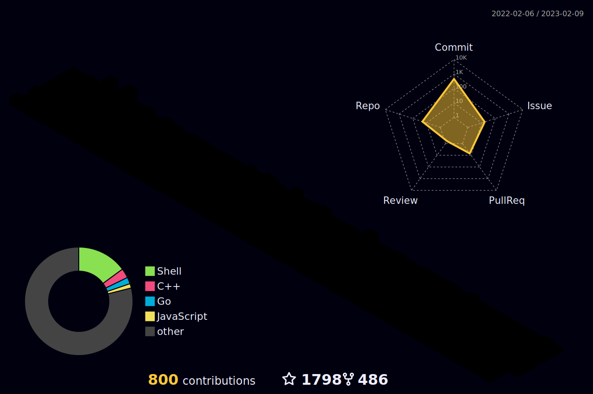

### Hi, I'm Barry! 👋

### Welcome to my  GitHub Profile
<!--
**Bardiafa/Bardiafa** is a ✨ _special_ ✨ repository because its `README.md` (this file) appears on your GitHub profile.

Here are some ideas to get you started:
-->

## ⚡ Platforms

## ⚡ Tec Stacks

  

## 🌎 Find me

## Introducing Bardia Fardar 🙋‍♂️

I am a multi-talented professional with a diverse skill set and a passion for technology. As a [Digital Marketer🥇], I bring creativity and strategic thinking to my work. As an [engineer🔧], I have a hands-on approach to problem-solving and a keen eye for detail.

With an insatiable thirst for knowledge🎓, I am always seeking new challenges and opportunities to grow. My strong background in both [marketing and engineering] allows me to bring a unique perspective to any project I work on.

From the latest trends in technology💻 to creative design solutions, I have a diverse range of interests and skills. Whether you're looking for a collaborative partner or a creative problem-solver, I'm here to bring my expertise to the table.

Let's work together to bring your vision to life!
